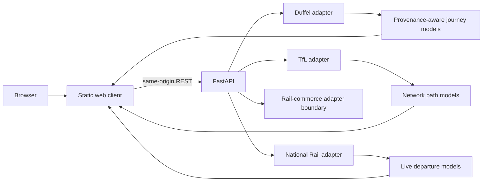

# FareSphere architecture

## Runtime

## Frontend

The production browser client has no package-manager runtime or build step. The custom globe converts latitude/longitude to a unit sphere, applies yaw/pitch rotation, projects into canvas coordinates and draws:

- latitude/longitude grid lines;
- TfL route paths from provider coordinates;
- selected journey arcs with elevated great-circle interpolation.

This reduces dependency/build risk and makes the rendering mathematics directly testable with Node's built-in test runner.

## Backend

Provider adapters are isolated under `backend/app/providers/`.

- `duffel.py`: provider-backed airline offer search.
- `tfl.py`: London line metadata and route sequences.
- `national_rail.py`: Rail Data Marketplace live departure-board parsing.
- `trainline.py`: explicit partner-contract boundary; no undocumented calls.
- `status.py`: non-secret provider configuration status for the UI.

## Accuracy boundary

The data model carries explicit provenance fields. Live and sample data cannot silently share the same status.

A feature that requires data not supplied by a configured provider must fail closed rather than estimate a value and label it as live.

## Future work

1. Add a licensed rail-fare source and unify verified rail fares with live flight offers.
2. Add Duffel ancillary-service pricing for checked baggage.
3. Add booking-time flight offer revalidation.
4. Add server-side result caching with short provider-aware TTLs.
5. Add PostgreSQL persistence for users, saved trips and price-alert subscriptions.
6. Add background alert jobs only after persistence and verified provider access are in place.
